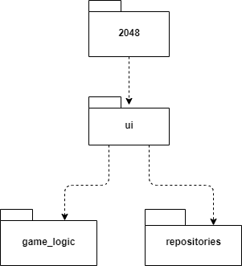
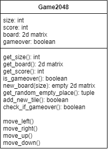
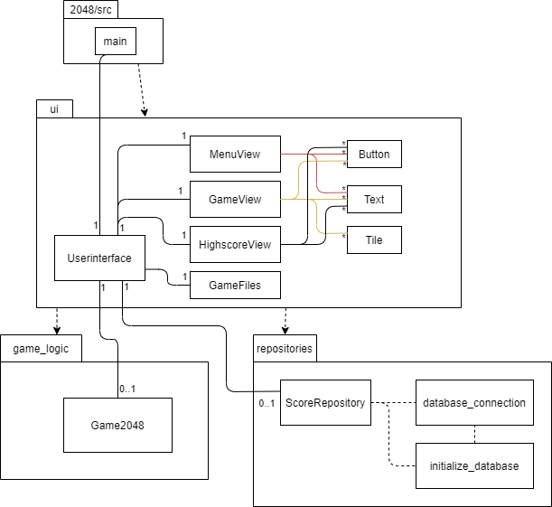

# Arkkitehtuurikuvaus

## Rakenne
Koodin pakkausrakenne on seuraavanlainen:  


Pakkaus *ui* sisältää käyttöliittymästä, *game_logic* pelilogiikasta ja *repositories* tuloksien tallennuksesta vastaavan koodin.

## Käyttöliittymä
Käyttöliittymä sisältää kolme eri näkymää:
- Menu
- Peli näkymä
- Tulostaulu näkymän  

Jokaisen näkymän luominen tapahtuu eri luokissa. Näkymien näyttämisestä sekä käyttäjän syötteiden tarkistamisesta määrää [Userinterface](../2048/src/ui/ui.py)-luokka. Käyttöliittymän on eristetty pelilogiikkasta, se vain kutsuu pelilogiikan metodeja. Jokaisen pelilogiikka metodin kutsun jälkeen, ui koodi päivittää peliruudun.

## Pelilogiikka
Pelin logiikka ja laskenta tapahtuu [Game2048](../2048/src/game_logic/game2048.py)-luokassa.



## Pelin pysyväistallennus
[ScoreRepository](../2048/src/repositories/score_repository.py)-luokka huolehtii pelin parhaimpien piesteiden talletuksesta. Tiedot tallennetaan SQLite-tietokantaan.
Tietokanta on yksinkertainen, vain yksi taulu kannassa.  
SQL schema: ```CREATE TABLE Highscores (board_size INTEGER, player_name TEXT, score INTEGER);```
Jos uusi pistetulos on suurempi kuin top5 pelaajan tulos, niin se tallennetaan tietokantaan. Samassa tietokannassa on kaikkien eri pelialuekokojen tulokset. Nämä voidaan erotella board_size kohdan avulla.

## Luokka/pakkauskaavio:



