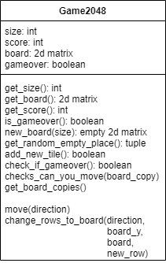
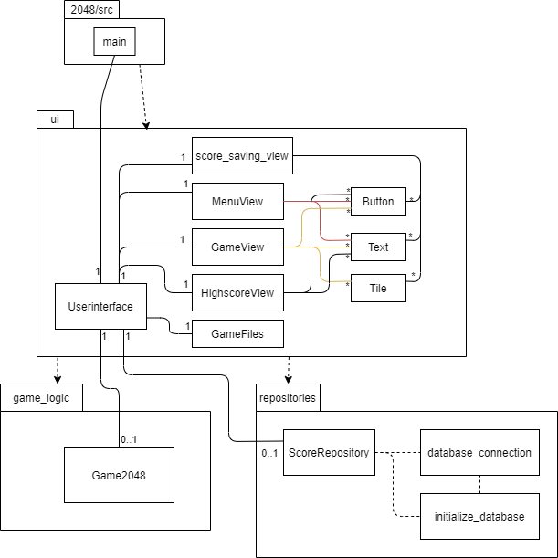
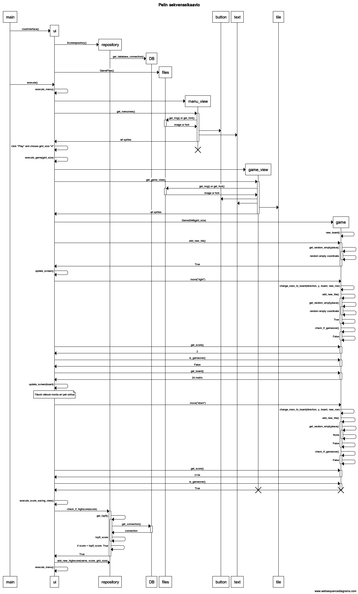

# Arkkitehtuurikuvaus

## Rakenne
Koodin pakkausrakenne on seuraavanlainen:  


Pakkaus *ui* sisältää käyttöliittymästä, *game_logic* pelilogiikasta ja *repositories* tuloksien tallennuksesta vastaavan koodin.

## Käyttöliittymä
Käyttöliittymä sisältää kolme eri näkymää:
- Menu
- Peli näkymä
- Tulostaulu näkymän  

Jokaisen näkymän luominen tapahtuu eri luokissa. Näkymien näyttämisestä sekä käyttäjän syötteiden tarkistamisesta määrää [Userinterface](../2048/src/ui/ui.py)-luokka. Käyttöliittymän on eristetty pelilogiikkasta, se vain kutsuu pelilogiikan metodeja. Tiettyjen pelilogiikka metodikutsujen jälkeen ui-koodi päivittää peliruudun.

## Pelilogiikka
Pelin logiikka ja laskenta tapahtuu [Game2048](../2048/src/game_logic/game2048.py)-luokassa.  


Ohjelma luo aluksi tyhjän pelialueen ```new_board()``` metodilla ja kutsuu ```add_new_tile()``` metodin heti sen jälkeen, mikä lisää pelialueelle tyhjään kohtaan uuden laatan arvolla 2 tai 4. Satunnaisen tyhjän alueen koordinaatit saa metodilla ```get_random_empty_place()```.  

Metodi ```move(direction)``` siirtää pelin laattoja metodissa mainittuun suuntaan ja yhdistävät kaikki vierekkäiset saman numeroiset laatat, samalla lisää muuttujaan *score* näiden kahden laatan summan.  
Sama metodi voi myös simuloida laattojen liikkeen ilman, että liikkeet päivittyy ruudulle tai oikealle pelilaudalle. Tällöin kutsutaan ```move(direction, check_if_can_move=True)```, eli metodi tarkastaa voidaanko laattoja liikuttaa tiettyyn suuntaan ja palauttaan *True* tai *False* tilanteen mukaan. Tämä metodi käyttää apunaan ```get_board_copies()``` ja ```checks_can_you_move(board_copy)``` -metodeita.

## Pelin pysyväistallennus
  
[ScoreRepository](../2048/src/repositories/score_repository.py)-luokka huolehtii pelin parhaimpien pisteiden talletuksesta. Tiedot tallennetaan SQLite-tietokantaan.
Tietokanta on yksinkertainen, vain yksi taulu kannassa.  
SQL schema:
```bash
CREATE TABLE Highscores (board_size INTEGER, player_name TEXT, score INTEGER);
```
Jos uusi pistetulos on suurempi kuin top5 pelaajan tulos, niin se tallennetaan tietokantaan. Samassa tietokannassa on kaikkien eri pelialuekokojen tulokset. Nämä voidaan erotella board_size kohdan avulla.

## Luokka/pakkauskaavio:


## Sekvenssikaavio pelaamisesta
Tämä sekvenssikaavio kuvaa, miten yhden pelin pelaamisen logiikka toimii alusta lähtien. Pelaaja valtisee menu valikosta pelialueen koon (grid_size). Tietyn ajan pelattuaan, pelialue täyttyy laatoista ja tilalle ei mahdu uusia laattoja, eikä pystytä liikuttamaan laattoja enää mihinkään suuntaan; peli päättyy. Jolloin tarkistetaan onko tulos top5 ainesta. Jos on, niin peli kysyy nimeä ja tallentaa sen tietokantaan.


