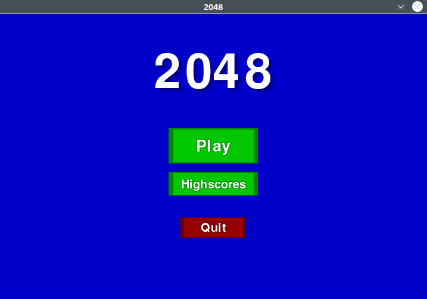
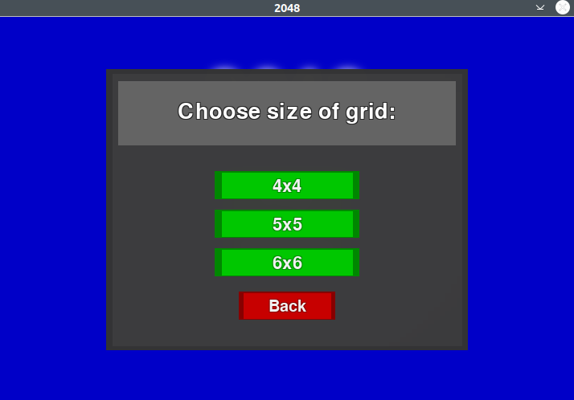
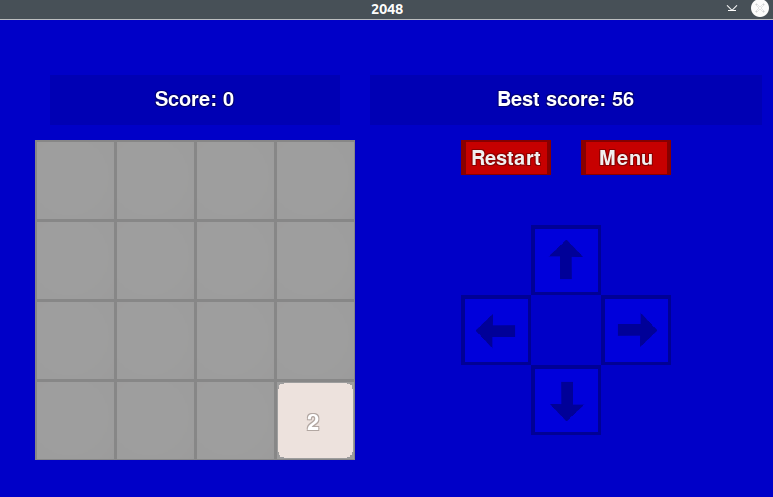
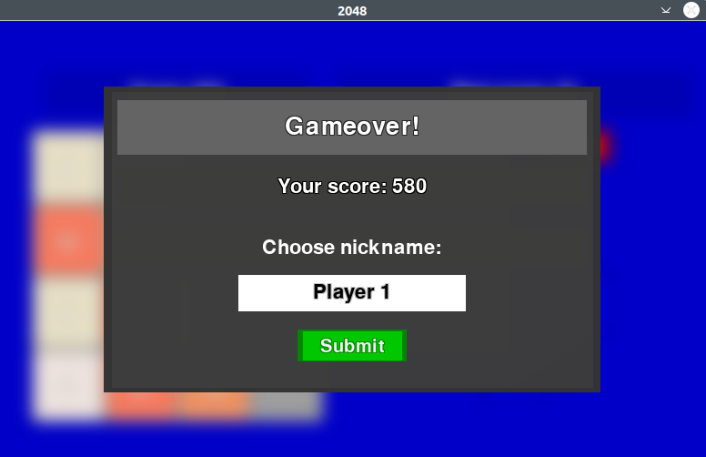
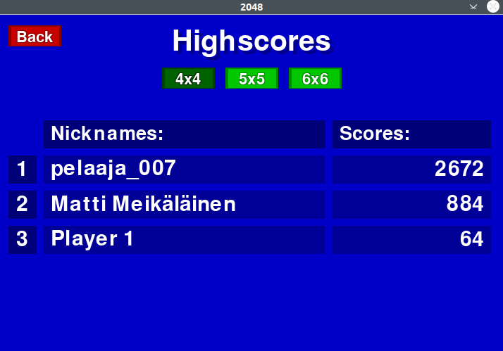

# Käyttöohje

## Poetryn asennus
<sub>**HUOM!** Tee tämä, jos koneellesi ei ole vielä asennettu Poetryä.</sub>  
1. Asennus onnistuu seuraamalla Poetryn [asennusohjeita](https://python-poetry.org/docs/#installation).
2. Suorita asennuksen jälkeen komento ```export PATH="$HOME/.poetry/bin:$PATH"```.  
Tämä asettaa PATH-muuttujaan polun Poetryn binääriin.

## Pelin asennus
Lataa projektin viimeisin [lähdekoodi](https://github.com/asnabryg/ot-harjoitustyo/releases) valitsemalla *Assets*-osion alta *2048_source_code_*(versionumero).zip.

Suorita seuraavat komennot kansiossa **2048/**

1. Asenna riippuvuudet komennolla:
```bash
poetry install
```

2. Käynnistä peli komennolla:
```bash
poetry run invoke start
```

## Pelaaminen
Ohjelma aukeaa Menu-valikkoon, josta voi siirtyä pelaamiseen, ennätyksiin tai poistua pelistä.  


"Play" -nappia painamalla avautuu ikkuna, jossa kysytää pelialueen kokoa:  


Pelikoon valitsemisen jälkeen, ruutu näyttää seuraavan:  
  
Voit pelata nuolinäppäimillä. Restart-nappi aloittaa uuden pelin ja Menu-napista pääsee takaisin valikkoon.  

Kun olet saavuttanut uuden ennätyksen, ja lopettanut pelin tai peli on päättynyt, peli kysyy nimimerkkiä johon tulos tallennetaan:  
  

Pelin ennätykset löytyy Highscores -valikosta Menussa. Voit valita minkä pelikoon tuloksia näytetään yllä olevista napeista. Tulokset näytetään top 5 asti:  
  
