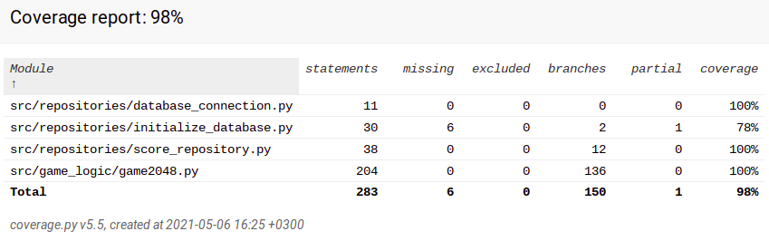

# Testausdokumentti

Pelilogiikka ja pelitulosten pysyväistallennusta on yksikkötestattu Unittest-sovelluskehyksen avulla.

## Yksikkötestaus
### Pelilogiikka
Luokkaa `Game2048` testataan [TestGame](https://github.com/asnabryg/ot-harjoitustyo/blob/master/2048/src/tests/game_test.py)-testiluokalla. Luokka alustaa ensin monta erilaista lautaa, jossa erilaisia pelitilanteita. Näin luokkaa testaa jokaisen perusliikkuttamisen sekä kaikki poikkeustilanteet.  
`Game2048`-luokka testataan kokonaan 100%.  
Peli toimii osin satunnaisarvoilla, joten testeissä on käytetty tiettyä siementä(seed), joka kerta.

### Pysyväistallennus
Luokkaa `ScoreRepository` testataan [TestRepository](https://github.com/asnabryg/ot-harjoitustyo/blob/master/2048/src/tests/repository_test.py)-testiluokalla.   
Tätä varten on myös testattu osin tiedostoja `initialize_database.py` ja `database_connection.py`, jotta saamme yhteyden tietokantaan.  
Tietokannan yhteys on tekaistu toiseen tietokantatiedostoon, jotta testaus ei sekoita itse pelin tuloksia. Molemmat yhteydet käyttävät samaa koodia, joten vain yhteyden saaminen oikeaan pelin tietokantaan jää testaamatta.  
`ScoreRepository`-luokka testataan 100%. Koodi testaa, että kaikki tallennukset menevät oikein ja ja tallentuvat myös. Testaa myös, että kaikki tulokset löytyvät tallennuksen jälkeen.

### Testauskattavuus
Pelin testauksen haarautumiskattavuus on 98%. Käyttöjärjestelmä-koodi on jätetty ulos testauksesta.  
  

## Järjestelmätestaus
Peliä on järjestelmätestattu manuaalisesti.

### Asennus ja käynnistäminen
Peliä on testattu [käyttöohjeen](./kayttoohje.md) mukaisesti Linux ympäristössä. (Mac- ja Windows-käyttöjärjestelmissä peliä ei ole testattu / suoritettu lainkaan.)  

### Toiminnallisuudet
Pelissä toimii kaikki, mitä [määrittelydokumentissa](./vaatimusmaarittely.md) listataan, ja ne testattu, myös erilaiset poikkeustilanteet.

## Tiedossa olevat ongelmat
Jos peliä yrittää pelata laitoksen koneella [etätyöpöytää](https://helpdesk.it.helsinki.fi/ohjeet/tietokone-ja-tulostaminen/tyoasemapalvelu/etakaytettavat-tyopoydat-vdi) käyttämällä, tulee *Database is locked* -virhe. Peli ei käynnisty tällöin lainkaan.
