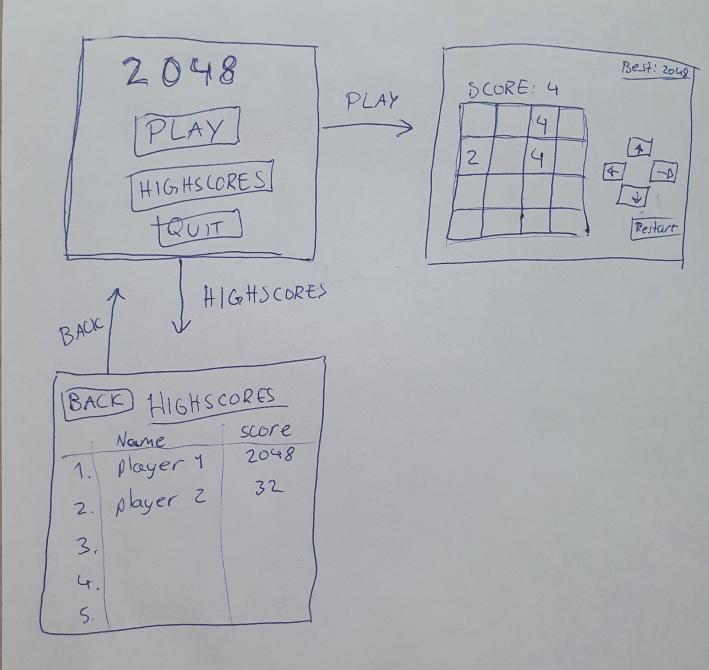

# Vaatimusmäärittely

## Pelin tarkoitus
Peli on nimeltään 2048. Pelissä liu'utetaan numeroituja laattoja ja yritetään yhdistää saman numeroiset laatat, jolloin yhdistetyn laatan numeroksi tulee 
näiden kahden laatan summa. Tavoitteena on saada laatta, jossa on numero 2048. Pelin alue on 4x4 ruudukko, mutta sitä voidaan 
suurentaa myös, jolloin pelin tavoitelaatan numerokin suurentuu. Peliä myös voidaan jatkaa tavoitteen saavuttamisen jälkeen.

## Pelattavuus
- Peliä pelataan nuolinäppäimillä tai pelissä olevalla käyttöliittymällä hiirellä painattaessa.
- Uusi laatta ilmestyy kentälle, jokaisella liu'utuksella, uuden laatan numero on 2 tai 4.
- Pisteitä keräntyy aina, kun pelaaja saa yhdistettyä kaksi laattaa.
- Kun ruudukossa ei ole enää tyhjiä ruutuja, eikä pelaaja pysty yhdistämään laattoja, peli loppuu.
- Pelin loputtua, peli tallentaa tuloksen top5 taulukkoon, jos pistemäärä on enemmän kuin taulukossa olevalla.
  - Samalla peli pyytää pelaajan nimimerkkiä, jolloin nähdään kuka tuloksen saavutti.
  
## Käyttöliittymä luonnos

## Pelin toimintaympäristö rajoitteet
- ohjelmiston tulee toimia Linux- ja OSX-käytöjärjestelmillä
- pelin parhaimmat tulokset tallennetaan paikallisen koneen levylle

## Jatkokehitysideoita
- 5x5 ja 6x6 lisä vaihtoehtoina pelialueena
- kaikkiin pelialueisiin oma top5 pelaajatulokset
